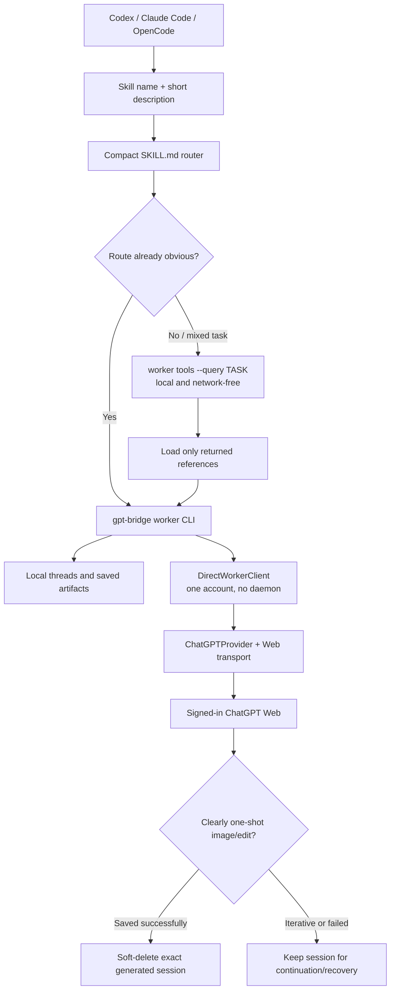

# GPT Bridge

**A local Web-session bridge and agent worker for your own machine.**

GPT Bridge is an independently maintained Python-first project. It combines a
direct one-account agent worker with an optional local OpenAI-compatible API:

- direct chat, images, vision, Deep Research, reports, and signed-in ChatGPT
  Web conversation continuation with no daemon;
- a one-account `worker` CLI optimized for agents and automation;
- an optional loopback API for clients that specifically require HTTP;
- persistent local task threads and non-destructive legacy migration;
- model-authored standalone HTML reports, including charts or interaction when
  that is the clearest answer; and
- a local operator console for account and runtime management.

> ภาษาไทย: GPT Bridge คือโปรเจกต์ Python-first ที่พัฒนาต่ออย่างอิสระ รวม Bridge API
> เดิมกับ workflow จาก `web-chat-bridge-cli` ไว้ในตัวเดียว สำหรับรันบนเครื่องของ
> คุณเอง ไม่ใช่ hosted service หรือ official OpenAI API

## Project direction

The original bridge and the separate web CLI are no longer treated as two
products. GPT Bridge is the source of truth:

| Component | Responsibility |
| --- | --- |
| Worker CLI | Default one-account, no-daemon agent path for chat, Web conversations, task threads, reports, images, and research |
| Bridge API | Optional account routing, model fallback, OpenAI-shaped HTTP API, and artifacts |
| Console | Local browser UI for accounts, health, capacity, storage, and API tools |
| Codex plugin | A local skill that teaches Codex to call the worker without touching browser credentials |

The project intentionally does **not** retain a Node/Bun runtime for the old
worker client. The old executable names remain as compatibility aliases while
their supported commands forward to the Python worker.

> ภาษาไทย: เป้าหมายคือให้ `gpt-bridge` เป็นตัวหลักเพียงตัวเดียว: API ดูแล
> worker แบบ direct เป็นทางหลักสำหรับ agent หนึ่งบัญชี ส่วน API/Console/Docker
> เป็นทางเลือกเมื่อจำเป็นต้องใช้ HTTP หรือหน้าจัดการ

## How agents discover and run GPT Bridge

GitHub renders this flow directly. The detailed
[agent capability map](docs/AGENT_CAPABILITY_MAP.md) lists every command,
reference group, script, host adapter, and session rule.



Only skill metadata is available before activation. The router loads after the
skill triggers, and detailed references load only when selected by
`worker tools --query`. The capability search itself does not use the account
or network.

## Important boundaries

- This is not an official OpenAI product or API.
- A ChatGPT Web capture contains credentials. Treat it like a password.
- Never commit, share, paste into chat, or expose captures/cookies/tokens.
- Do not turn this into a public proxy, multi-tenant service, resale endpoint,
  or a mechanism to evade provider limits.
- Browser login and message sending are visible user actions. The setup command
  may capture the resulting request locally, but an agent must never run
  onboarding or handle the session material for you.

Read [DISCLAIMER.md](DISCLAIMER.md) and [SECURITY.md](SECURITY.md) before
using a Web session. This is an unofficial local experiment, not a hosted or
shared proxy, and it must not be used to bypass provider controls.

> ภาษาไทย: อย่าแชร์ cookie, bearer token หรือ request capture ให้ใคร รวมถึงใน
> chat นี้ด้วย ให้ใช้ `gpt-bridge setup` ใน terminal ของตัวเองเท่านั้น

## Quick start: direct worker (no Docker)

Prerequisites: Python 3.11 or newer and a local checkout.

```powershell
python -m pip install -e .
```

Run one user-controlled local setup:

```powershell
gpt-bridge setup
gpt-bridge worker doctor --json
gpt-bridge worker chat --message "Reply in one short sentence" --json
```

`gpt-bridge setup` opens a one-shot page on `127.0.0.1` in your normal browser.
Use your existing signed-in ChatGPT tab, copy one conversation request as cURL,
paste it into the large local form, and click Save. GPT Bridge validates it,
stores it encrypted under the stable per-user config directory, verifies the
account, closes the temporary setup server, and exits. It does not require a
persistent server, local API key, Docker, or account routing.

Chat and report commands default to `gpt-5-6-sol-high`, the verified ChatGPT Web
mapping for `gpt-5-6-thinking` with `thinking_effort=extended`. This Web wire
mapping is intentionally different from the official API spelling
`gpt-5.6-sol`.

> ภาษาไทย: รัน `gpt-bridge setup` ครั้งเดียว ระบบเปิดหน้าตั้งค่า local ใน
> browser ปกติ ใช้ ChatGPT tab ที่ login อยู่แล้ว copy request เป็น cURL
> มา paste ในกล่องใหญ่แล้วกด Save จากนั้นระบบเข้ารหัส ตรวจสอบ และปิด server
> ชั่วคราว การใช้ agent แบบปกติไม่ต้องเปิด Docker หรือ server ค้างไว้

### Add or refresh an account capture

#### Primary one-shot local setup

```powershell
gpt-bridge setup
```

Read the consent text and choose **yes**. The command opens a tokenized
`127.0.0.1` page in your normal browser. Follow its short Network-tab
instructions, paste one complete Copy-as-cURL request into that page, and click
Save. The command never prints the session, stores it only through the
encrypted local account store, verifies it, and exits. `gpt-bridge auth login
--account main` is the equivalent lifecycle command.

> ภาษาไทย: วิธีนี้ใช้ browser ปกติที่ login อยู่แล้ว หน้า setup เปิดเฉพาะ
> `127.0.0.1` และรับ capture หนึ่งครั้งก่อนปิด ระบบไม่แสดงหรืออัปโหลด session
> และไม่ต้อง paste หลายบรรทัดลง terminal

#### Manual fallback

Use a private capture file only when the one-shot setup page is incompatible:

```powershell
gpt-bridge auth import --account main --capture-file .\private-chatgpt-request.txt
```

Delete the plaintext file after a successful import. Do not paste captures,
cookies, tokens, or screenshots into agent chat. If a request returns
`token_invalidated`, rerun `gpt-bridge setup`; restarting Docker does not
refresh ChatGPT credentials.

> ภาษาไทย: หากเจอ `token_invalidated` ให้ capture ใหม่ผ่าน Accounts ใน Console
> การ restart Docker ไม่สามารถแก้ token ที่หมดอายุได้

## Install agent integrations

The repository ships native adapters for Codex, Claude Code, and OpenCode.
Python 3.11 or newer is required. From a checkout, preview the changes and then
install the Python runtime plus every available host integration:

You can also give an agent the repository URL and say:

> Install GPT Bridge from `https://github.com/Grunte12/gpt-bridge.git` for my
> current agent host. Do not start the service or handle browser credentials.

No marketplace is required. The installer copies the same small skill into the
native Codex, Claude, and OpenCode skill directories and installs an OpenCode
tool adapter.

```powershell
python scripts/install-agent-integrations.py --dry-run
python scripts/install-agent-integrations.py
```

The installer is explicit and non-interactive. It does not start the Bridge,
perform browser login, or read/copy account credentials.

| Host | Installed integration |
| --- | --- |
| Codex | Copies `gpt-bridge-worker` into the user or project skill directory |
| Claude Code | Copies the same `gpt-bridge-worker` skill into the user or project skill directory |
| OpenCode | Copies the shared skill and installs native `gpt_bridge_*` tools that invoke the direct CLI without changing provider or model configuration |

Install selected hosts by repeating `--target`:

```powershell
python scripts/install-agent-integrations.py --target codex --target claude
python scripts/install-agent-integrations.py --target opencode --scope project --set-opencode-default
```

After the Python package is installed, the equivalent host-only command is:

```powershell
gpt-bridge integrations install --target codex --target claude --target opencode
```

Useful controls:

- `--scope user|project` controls Claude Code and OpenCode scope. Codex uses its
  normal user plugin configuration.
- `--source <path-to-this-repo>` selects the local checkout that contains the
  shared skill source.
- `--skip-runtime` registers host adapters without running the editable Python
  package installation.
- `--set-opencode-default` is legacy opt-in for selecting the optional HTTP
  provider. It requires the gateway and is not needed by the direct tools.
- With that opt-in only, `--opencode-config PATH` selects a strict-JSON
  OpenCode config; the installer backs up an existing file before changing it.

After installation, set `CHATGPT_ACCOUNT` to the one imported alias and begin
with:

```powershell
gpt-bridge worker doctor --json
```

Existing ChatGPT Web conversations are also reusable agent context. The bridge
can list compact metadata, export the selected current branch, or append any
agent-authored message without replaying the transcript:

```powershell
gpt-bridge worker web list --query "project title" --json
gpt-bridge worker web show --conversation https://chatgpt.com/c/CONVERSATION_ID --output context.md --json
gpt-bridge worker web pull --conversation CONVERSATION_ID --output-path latest.png --json
gpt-bridge worker web send --conversation CONVERSATION_ID --message "Produce the exact implementation artifact needed now." --json
gpt-bridge worker web delete --conversation CONVERSATION_ID --yes --json
```

These are generic primitives rather than fixed handoff templates. `web pull`
syncs assistant-generated images from the current branch. An agent can
use the same session for implementation planning, decision extraction,
critique, writing, research follow-up, image refinement, or a new purpose.
`web send` modifies the selected ChatGPT conversation; `web show` is read-only.

## Worker: the unified agent interface

Install locally for development:

```powershell
python -m pip install -e ".[dev]"
```

Check the direct runtime:

```powershell
gpt-bridge worker tools --query "describe the task" --json
gpt-bridge worker doctor --json
gpt-bridge worker status --json
```

`worker tools` is a network-free discovery index for agents. It returns only a
compact capability list by default, or a few matching routes and exact
on-demand reference paths for `--query`. Codex and Claude therefore receive the
skill description first, the short router only when triggered, and detailed
guides only for the selected task.

Use chat with an optional durable local task thread:

```powershell
gpt-bridge worker chat --message "Review this implementation" --json
gpt-bridge worker chat --message "Continue from the previous findings" --thread review --json
gpt-bridge worker thread list
gpt-bridge worker thread show review
```

Direct mode is the default and intentionally refuses account pools. Set one
alias with `CHATGPT_ACCOUNT` or
`gpt-bridge worker --account NAME <command>`. If an application requires the
optional HTTP gateway, use `gpt-bridge worker --transport http ...`.

> ภาษาไทย: `worker` เรียก ChatGPT Web โดยตรงแบบหนึ่งบัญชีและจบ process หลังงาน
> เสร็จ Thread เก็บ context ของ task ไว้ในเครื่อง

### Rich HTML reports

`worker report` does not force Markdown or a fixed HTML template. The model
returns the complete report document, which is saved as-is. It may choose inline
CSS, SVG, Canvas, or JavaScript for charts and interaction when appropriate.

```powershell
gpt-bridge worker report `
  --prompt "Analyse monthly revenue and choose useful charts" `
  --out .\outputs\revenue-report.html `
  --json
```

The CLI does not automatically open the file.

The returned HTML is not sanitized. Treat it as untrusted active content and
inspect it before opening it in a browser.

> ภาษาไทย: report ให้โมเดลเลือกวิธีนำเสนอที่มีประสิทธิภาพที่สุดเอง ไม่ถูกล็อก
> ด้วย template จึงทำกราฟหรือ interaction ขั้นสูงได้

### Images and Deep Research

```powershell
gpt-bridge worker image --prompt "Deliverable: product hero. Canvas: wide landscape. Content: one clean product silhouette. Visual direction: premium studio photography. Constraints: no text, no unrelated objects, no watermark." --output-path .\work\image-draft.png --brief
gpt-bridge worker edit --prompt "Change only the background to warm gray. Preserve product geometry, label, camera, and lighting." --input-image .\work\image-draft.png --output-path .\work\image-draft.png --brief
gpt-bridge worker image --prompt "Frontend asset: isolated decorative leaf cluster, no text or scenery." --output-path .\src\assets\generated\leaf-cluster.png --transparent --brief
gpt-bridge worker image --prompt "One-shot disposable concept, no text." --output-path .\work\one-shot.png --cleanup-session --brief
gpt-bridge worker research --prompt "Compare these options with sources" --json
```

Agents should prepare each production-ready image prompt locally and use
`--brief` to keep only output locations in their context. They may regenerate
or refine as many times as needed, reusing one draft path and inspecting only
the latest result. When the host supports an isolated worker or subagent, keep
the image iteration there and return only the accepted path to the main task.
For clearly one-shot image or edit work, `--cleanup-session` soft-deletes the
generated ChatGPT conversation after the local file is saved and transparency
processing succeeds. Omit it for iterative work or whenever recovery/follow-up
may matter. Manual `worker web delete` also requires `--yes` and an exact
conversation ID or URL.
The legacy `--enhance` option is not recommended; if its result looks like an
image artifact or file path, the CLI rejects it and falls back to the original
prompt. Deep Research can be long-running and consumes the account's available
capacity.

Only the skill description is exposed before activation. After activation, its
small router loads one primary deliverable guide—including frontend assets,
photos, illustrations, infographics, diagrams, educational, product, UI,
brand, story, scientific, spatial, or presentation work—and only applicable
risk overlays. Detailed guides do not enter agent context unless selected.

Use `worker edit` for targeted correction, reference-guided restyling,
localization, identity/product preservation, or multi-image compositing. It
accepts up to 10 ordered `--input-image` values and supports the same compact
`--brief` response as generation. This prevents each refinement from starting
from zero and reduces prompt drift.

For frontend assets, `--transparent` requires a `.png` output path. It requests
native alpha, then verifies the saved image. If the ChatGPT Web output is
opaque, the CLI removes only a flat edge-connected matte; it refuses a complex
background instead of damaging the subject. Inspect accepted assets on both
light and dark backgrounds before importing them into the frontend.

Presentation mode generates one accepted 16:9 image per slide and combines the
ordered images into a flattened `.pptx`:

```powershell
python <installed-skill>\scripts\images_to_pptx.py `
  --out .\outputs\visual-deck.pptx `
  --title "Visual Deck" `
  .\work\slide-01.png .\work\slide-02.png .\work\slide-03.png
```

Slide contents in this mode are images and are not individually editable.

## Legacy web-chat-bridge-cli transition

The Python worker replaces the old Node CLI. These commands remain available
during the compatibility period:

```powershell
web-chat-bridge status --json
wcbridge doctor --json
```

They print a deprecation notice and forward supported commands to
`gpt-bridge worker`. The former `chatgpt-api` command remains a compatibility
alias. Legacy environment variables are accepted as fallbacks:

| New setting | Compatibility fallback |
| --- | --- |
| `CHATGPT_BASE_URL` | `BRIDGE_URL` |
| `CHATGPT_API_KEY` | `BRIDGE_TOKEN` |
| `CHATGPT_WORKER_DATA_DIR` | `WCBRIDGE_DATA_DIR` |
| `CHATGPT_STACK_DIR` | `WCBRIDGE_STACK_DIR` |

Import old worker threads without changing or deleting their originals:

```powershell
gpt-bridge worker migrate wcbridge --json
```

> ภาษาไทย: คำสั่งเก่าใช้ต่อได้ชั่วคราว แต่ควรย้ายมา `gpt-bridge worker` และใช้
> `migrate wcbridge` เพื่อ copy thread เดิมอย่างปลอดภัย

## Optional HTTP API and Docker

Docker is packaging for the always-on API plus Console; it is not required for
the direct worker. Use it only for OpenAI-compatible clients, account routing,
or the browser Console. The same API can run without Docker:

```powershell
$env:CHATGPT_API_KEY = "YOUR_LOCAL_KEY"
gpt-bridge serve --account main --host 127.0.0.1 --port 8000 --api-key $env:CHATGPT_API_KEY
```

The Docker alternative is documented in [docs/DOCKER.md](docs/DOCKER.md).

The server exposes an OpenAI-shaped local API. Use a local bearer key in real
deployments instead of leaving the development default in place.

```powershell
curl http://127.0.0.1:8000/v1/models `
  -H "Authorization: Bearer YOUR_LOCAL_KEY"
```

```powershell
curl http://127.0.0.1:8000/v1/chat/completions `
  -H "Authorization: Bearer YOUR_LOCAL_KEY" `
  -H "Content-Type: application/json" `
  -d '{"model":"auto","messages":[{"role":"user","content":"Reply in one short sentence."}]}'
```

Useful endpoints:

| Route | Use |
| --- | --- |
| `GET /health` | Liveness/readiness |
| `GET /v1/models` | Exposed model aliases |
| `POST /v1/chat/completions` | Chat and streaming |
| `POST /v1/images/generations` | Image generation |
| `POST /v1/images/edits` | Image edit/composite |
| `POST /v1/chatgpt/vision` | OCR and image description |
| `POST /v1/chat/completions` with Deep Research | Long-running research |
| `GET /v1/chatgpt/admin/status` | Local runtime status |

See [docs/OPENAI_COMPATIBILITY.md](docs/OPENAI_COMPATIBILITY.md) for request
shapes and [docs/CLI.md](docs/CLI.md) for the complete CLI reference.

## Models, routing, and accounts

Account names are your own local aliases, not subscription-plan names. The
router can select one account or route across a temporary account pool using
strategies such as `failover`, `random`, `round-robin`, or `quota-aware`.

```powershell
gpt-bridge api chat `
  --message "Summarize these notes" `
  --accounts work-main,personal-main `
  --account-strategy failover `
  --base-url http://127.0.0.1:8000/v1 `
  --api-key YOUR_LOCAL_KEY
```

Model aliases reflect what the local account/router exposes. Inspect them
instead of hard-coding assumptions:

```powershell
gpt-bridge worker doctor --json
gpt-bridge admin models --json --base-url http://127.0.0.1:8000/v1 --api-key YOUR_LOCAL_KEY
```

> ภาษาไทย: ชื่อ account เช่น `personal-main` เป็น alias ในเครื่อง ไม่ใช่ plan
> ของ ChatGPT และ model ที่ใช้ได้จริงควรดูจาก `worker doctor` หรือ `admin models`

## Conservative stack controls

For an existing Compose checkout, the worker can control only known lifecycle
operations. It never builds images automatically and never removes volumes.

```powershell
$env:CHATGPT_STACK_DIR = "C:\path\to\gpt-bridge"
gpt-bridge worker stack status --json
gpt-bridge worker stack restart
```

## Agent skill and tool distribution

The shared agent skill source lives at
[plugins/gpt-bridge/skills/gpt-bridge-worker](plugins/gpt-bridge/skills/gpt-bridge-worker).
The installer copies it directly to `~/.codex/skills/gpt-bridge-worker` or
`~/.claude/skills/gpt-bridge-worker`; project scope uses `.agents/skills` or
`.claude/skills`. This private checkout workflow does not need a marketplace,
plugin release, or host CLI registration command.

[.claude/skills/gpt-bridge-worker](.claude/skills/gpt-bridge-worker) remains as
a project-scoped development copy for sessions opened directly in this
repository.

For OpenCode, the installer copies the shared skill under its user or project
skill directory and places a native tool module beside it. It exposes
`gpt_bridge_doctor`, `gpt_bridge_chat`, `gpt_bridge_research`,
`gpt_bridge_image`, and `gpt_bridge_report`. These tools spawn the direct CLI
and do not need a server. They do not alter OpenCode's provider or default
model. The old `@ai-sdk/openai-compatible` provider remains available only
through explicit `--set-opencode-default` opt-in.

> ภาษาไทย: tools ของ integration ทั้งสามเรียก CLI แบบ direct ไม่ต้องเปิด
> Bridge server และไม่ login หรือจับ cookie แทนผู้ใช้

## Verification

Current local release-candidate checks include:

```powershell
python -m compileall -q chatgpt_api
python -m pytest -q
git diff --check
docker compose build gpt-bridge bridge-console
docker compose up -d gpt-bridge bridge-console
gpt-bridge worker doctor --json
```

The full provider-facing checks (`worker chat`, reports, images, and research)
require a live account capture. A `token_invalidated` response is an account
credential refresh issue, not a Docker readiness issue.

## Repository map

```text
chatgpt_api/                 Python Bridge API, providers, worker, compatibility CLI
chatgpt_api/worker/          Direct client, capability search, storage, migration, stack controls
chatgpt_api/assets/opencode/ Native OpenCode worker tools
apps/bridge-console/         Svelte operator console
plugins/gpt-bridge/          Shared Codex and Claude Code plugin/skill
.claude-plugin/              Claude Code marketplace
.claude/skills/              Project-scoped Claude Code worker skill
integrations/                Consumer integrations and examples
scripts/install-agent-integrations.py  Cross-host installer
docs/                        Architecture, API compatibility, CLI, handoff notes
tests/                       Python regression suite
```

## Documentation

- [Agent capability map and structure](docs/AGENT_CAPABILITY_MAP.md)
- [CLI reference](docs/CLI.md)
- [OpenAI compatibility](docs/OPENAI_COMPATIBILITY.md)
- [Architecture](docs/ARCHITECTURE.md)
- [Release checklist](docs/RELEASE_CHECKLIST.md)
- [Provenance and release boundary](PROVENANCE.md)

## License and responsibility

This repository is MIT-licensed. You are responsible for complying with the
terms and policies that apply to your ChatGPT account and any services you
connect. Keep the Bridge local, protect its credentials, and verify outputs
before using them for important decisions.

The license covers this repository's code only; it grants no rights to OpenAI,
ChatGPT, their marks, or any third-party service. See [DISCLAIMER.md](DISCLAIMER.md).

> ภาษาไทย: ใช้โค้ดภายใต้ MIT ได้ตามเงื่อนไข แต่คุณต้องรับผิดชอบการใช้งาน account
> และผลลัพธ์ของระบบเอง ควรรัน local, ปกป้อง credentials และตรวจคำตอบก่อนใช้จริง
